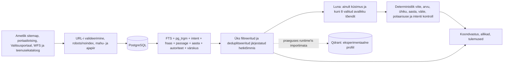

# Vastuvõtutõendite register

See fail seob projekti tootmisvalmiduse väited korduvkäivitatavate testide, runtime'i konfiguratsiooni ja koodiga. Avalikud testpäringud on fikseeritud näited ega sisalda kasutajaandmeid. Tootmise täpsed loendurid ja ajatemplid lisatakse pärast sama funktsionaalse commit'i Coolify deploy'd.

## Otsingu hindamisspetsifikatsioon

`evaluation/environment_search_queries_v1.json` sisaldab 59 külmutatud päringut. Neist 24-l on käsitsi valitud oodatud esikoha allikas. Oodatud allikas on küsimuse intenti otseselt teenindav ametlik püsileht, juhis, register või kaardirakendus, mitte kõige rohkem märksõnu sisaldav uudis.

Faili `coverage` väli seob juhtumid järgmiste klassidega: faktiküsimus, õiguslik või menetluslik küsimus, asukoht, live- või hädaolukord, võrdlus, kõnekeel, kirjaviga, diakriitikata tekst, eesti käänded, täpsustamist vajav päring ning teemaväline/prompt-injection päring. Nulltulemuse leping nõuab HTTP 200 vastust, null nähtavat tulemust, null vastuseallikat ja null viidet.

Kontrollid:

- `npm test` kontrollib kõigi 59 juhtumi intenti ja 24 qrel'i deterministlikku esikohta;
- `npm run eval:live -- --base-url=https://praktika.arleserver.cfd` kontrollib samu 24 esikohta tootmises ning lisaks vastuse, viidete, filtrite, lehitsemise, privaatsusväljade ja terviklausete avalikku lepingut;
- `npm run audit:grounding -- --base-url=https://praktika.arleserver.cfd` kontrollib kümmet esinduslikku maandatud vastust ja kümmet adversariaalset loobumist, viidatud URL-ide HTTP 200 olekut ning väidete sõna- ja arvutuge;
- `npm run audit:load -- --base-url=https://praktika.arleserver.cfd` kontrollib 20 samaaegset kasutajat ja 21. päringu 429 backpressure'i.

## Runtime'i andmevoog

PostgreSQL on püsiv tööandmebaas. `practice_corpus_documents` hoiab normaliseeritud dokumente, täisteksti, metaandmeid ja `tsvector` indeksit. `practice_search_cache` hoiab versioonitud vastusepuhvrit ilma `query` väljata. `practice_search_runs` hoiab ainult päringu SHA-256 räsi, redigeeritud tekstivälja, kestust ja dokumentide ID-sid.

Korpuse loendurite täpsed definitsioonid:

- `documents`: `is_available = TRUE` unikaalsete `canonical_url` ridade arv;
- `official`, `reviewed`, `supplementary`, `other`: üksteist välistavad `source_tier` klassid, mille summa võrdub `documents`;
- `hydrated`: kõigi klasside ristlõige, kus `content <> ''`; see ei ole eraldi allikaklass;
- `metadataOnly`: `content = ''`; `hydrated + metadataOnly = documents`;
- `distinctContent`: mittetühjade `content_hash` väärtuste unikaalne arv;
- `robotsExcluded`: read, mille päis või HTML märkis `noindex`; neid ei tagastata aktiivse korpusena.

Korduv import on idempotentne: `canonical_url` on unikaalne, lisaks on unikaalne paar `source_key + external_id`, ning UPSERT uuendab sama rida. `last_seen_run` ja `last_seen_at` annavad värskuse; ametlikust sitemapist kadunud read märgitakse `is_available = FALSE`, mitte ei anta uue ID all uuesti välja. Viited kasutavad sama vastuse järjestatud allikaloendi stabiilseid numbreid ja kanoonilisi URL-e.

Qdrant on ainult Compose'i `experimental-vector` profiil. `server/qdrant.mjs` kasutab 256-mõõtmelist deterministlikku hash-vektorit; ükski tootmise otsingumoodul seda faili ei impordi. Seetõttu ei nimetata seda semantiliseks põhiotsinguks ega tootmise kuumaks teeks.

## AI-provideri piir

Tootmise vastusetee on `server/pipeline.mjs` → `server/llm.mjs` → OpenCode Go Responses API. Deploy määrab `LLM_MODEL=gpt-5.6-luna`, `LLM_API_STYLE=responses` ja tühja fallback-mudeli. Avalik marsruut ei saa neid keskkonnamuutujaid muuta. DeepSeek V4 Flash töötab ainult Codexi arendus-Swarmi planeerimis- ja auditikihis; see ei kraabi ega vasta tootmisrakenduse päringutele.

Mudeli sisend sisaldab küsimust, ranget JSON skeemi ja kuni kaheksa juba järjestatud avaliku allika piiratud tõendit. Mudelil pole PostgreSQL-i, Qdranti, Terrapointi, shelli ega veebitööriistu. Väljund avaldatakse ainult deterministlike kontrollide läbimisel; muidu jääb kasutusele kontrollitud allikapõhine draft.

## Dokumentatsiooni ja koodi kaart

| Väide | Rakenduskoht | Kontroll |
|---|---|---|
| PostgreSQL-i skeem, FTS ja tombstone | `server/corpus.mjs` | `npm test`, `/api/corpus`, SQL risttabel |
| Päringu redaktsioon ja cache'i säilitus | `server/database.mjs`, `server/pipeline.mjs` | andmebaasi null-loendurid, cache'i unit-testid |
| Ühine järjestatud hetktõmmis | `server/retrieval.mjs`, `server/pipeline.mjs` | 24 qrel'i, filtri- ja viitetestid |
| Luna range JSON ja maandatus | `server/llm.mjs` | adversariaalsed LLM unit-testid, live grounding audit |
| 15 s globaalne vastusepiir | `server/index.mjs`, `server/pipeline.mjs` | fault-injection ja live load audit |
| Terrapointi täisrakendus | `src/App.jsx`, CSP `frame-src` | desktopi/mobiili Playwrighti teekond |
| POST-põhine privaatne UI-otsing | `src/App.jsx`, `server/index.mjs` | brauseri request-list, nonce test |
| Qdrant pole tootmise otsinguteel | `server/qdrant.mjs`, `compose.yaml` | impordigraafi kontroll, profiilide Compose validation |

## Avalike marsruutide inventar

| Meetod | Tee | Mõju ja piir |
|---|---|---|
| GET | `/api/health` | ainult tervis, ei muuda olekut |
| GET/POST | `/api/search` | ainult otsing; UI kasutab POST-i; 180 märki, 15 s, 20 päringut minutis |
| GET/POST | `/api/search/results` | ainult lehitsemine/filtrid; UI kasutab POST-i |
| POST | `/api/search/follow-up` | ainult vastus; kuni neli varasemat küsimust ja 520 märki konteksti |
| GET | `/api/corpus` | ainult agregeeritud avalikud loendurid |
| GET/POST | `/api/suggestions` | ainult soovitused; UI kasutab POST-i; 80 märki |
| GET | `/api/terrapoint/address` | fikseeritud Terrapointi upstream; vaba URL puudub |
| GET | `/api/terrapoint/parcel/:number` | ainult valideeritud katastritunnus; fikseeritud upstream |

Admin-, faili üleslaadimise, autentimise ega olekut muutvat avalikku marsruuti ei ole. Tundmatu `/api/*` või lubamatu meetod lõpeb JSON 404-ga ega lange SPA HTML-i. Välised serveripäringud kasutavad HTTPS-i hostiallowlisti, kontrollivad iga redirect'i, piiravad vastuse mahtu ja katkestavad tähtajal; kasutaja ei saa anda fetch'ile suvalist URL-i.

Turvapäised on HSTS, CSP, `frame-ancestors`, Referrer-Policy, nosniff, Permissions-Policy ja `X-Robots-Tag`. CORS päist ei avata, seega jäävad API vastused same-origin poliitika alla. React kodeerib nähtava kasutajateksti ning CSP ei luba inline-skripti.

## Otsingupäringu privaatsuspiir

UI ei pane toorpäringut aadressiribale, lehe pealkirja, `history.state` objekti, cookie'sse, `localStorage`'isse ega `sessionStorage`'isse. Brauseri back/forward kasutab ainult protsessimälus olevat läbipaistmatut ID-d ja kuni 50 kirjega piiratud mälukaarti. Sama päritolu API saab päringu JSON POST-kehas, sest see on funktsiooni jaoks vajalik. Server saadab päringu vajalikus ulatuses ametlikule otsinguteenusele ja Lunale, kuid ei lisa brauseri IP-d, cookie'sid, tervet korpust ega andmebaasilogi.

POST-keha võib olla nähtav kasutaja enda brauseri DevToolsis ja vajalikul välisel teenusepakkujal. See piirang on teadlikult dokumenteeritud; rakenduse, proxy ja PostgreSQL-i logidesse toorpäringut ei kirjutata.
