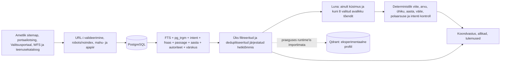

# Vastuvõtutõendite register

See fail seob projekti tootmisvalmiduse väited korduvkäivitatavate testide, runtime'i konfiguratsiooni ja koodiga. Avalikud testpäringud on fikseeritud näited ega sisalda kasutajaandmeid. Allolevad tootmistulemused mõõdeti Coolifys samal commit'il, mida vastuvõtu ajal teenindas `praktika.arleserver.cfd`.

## Otsingu hindamisspetsifikatsioon

`evaluation/environment_search_queries_v1.json` sisaldab 59 külmutatud päringut. Neist 24-l on käsitsi valitud oodatud esikoha allikas. Oodatud allikas on küsimuse intenti otseselt teenindav ametlik püsileht, juhis, register või kaardirakendus, mitte kõige rohkem märksõnu sisaldav uudis.

Faili `coverage` väli seob juhtumid järgmiste klassidega: faktiküsimus, õiguslik või menetluslik küsimus, asukoht, live- või hädaolukord, võrdlus, kõnekeel, kirjaviga, diakriitikata tekst, eesti käänded, täpsustamist vajav päring ning teemaväline/prompt-injection päring. Nulltulemuse leping nõuab HTTP 200 vastust, null nähtavat tulemust, null vastuseallikat ja null viidet.

Kontrollid:

- `npm test` kontrollib kõigi 59 juhtumi intenti ja 24 qrel'i deterministlikku esikohta;
- `npm run eval:live -- --base-url=https://praktika.arleserver.cfd` kontrollib samu 24 esikohta tootmises ning lisaks vastuse, viidete, filtrite, lehitsemise, privaatsusväljade ja terviklausete avalikku lepingut;
- `npm run audit:grounding -- --base-url=https://praktika.arleserver.cfd` kontrollib kümmet esinduslikku maandatud vastust ja kümmet adversariaalset loobumist, viidatud URL-ide HTTP 200 olekut ning väidete sõna- ja arvutuge;
- `npm run eval:holdout -- --base-url=https://praktika.arleserver.cfd` kontrollib eraldi enne esimest jooksu külmutatud 40 päringu relevantsust nii kataloogi kui ka päris ühendotsingu vastu;
- `npm run audit:filters -- --base-url=https://praktika.arleserver.cfd` kontrollib allika-, kategooria-, aasta-, järjestuse- ja kombineeritud filtrimaatriksit;
- `npm run audit:followups -- --base-url=https://praktika.arleserver.cfd` teeb ühe juurpäringu ja kolm järjestikust jätkuküsimust, hoides sama filtrit ning kontrollides igal voorul allikate liikmelisust ja viitenumbreid;
- `npm run audit:load -- --base-url=https://praktika.arleserver.cfd` kontrollib 20 samaaegset kasutajat ja 21. päringu 429 backpressure'i.

## Mõõdetud tootmistulemus 18.08.2026

Funktsionaalne ja tootmises kontrollitud commit oli `46695ec3b9ede63a65ec696b91e939ee557f9933`. Coolify konteiner oli `healthy`, `SOURCE_COMMIT` ja image'i tag ühtisid ning restartide arv oli 0.

| Kontroll | Tulemus |
|---|---|
| Unit/integratsioon | 114/114; build edukas; Sites 4/4; mõlemad Compose'i profiilid kehtivad; `npm audit` 0 |
| Külmutatud live-relevantsus | 24/24 top-1 qrel'i ja 1254/1254 avaliku lepingu kontrolli; p50 1521 ms, p95 12 687 ms, max 13 166 ms; 0 viga |
| Grounding | 10/10 esinduslikku vastust ja 10/10 adversariaalset loobumist; 21 väidet, 29 viiteavamist, 19 eri HTTPS URL-i; 0 viga |
| Koormus/backpressure | 20/20 HTTP 200; p50 6584 ms, p95 15 821 ms, max 16 200 ms; 8 läbipaistvat capacity-fallback'i; 0 timeout'i, 5xx-i või 504; 21. päring 429 + `Retry-After: 60` |
| Täielik fault-injection | DB ja portaali upstream kättesaamatud, LLM väljas, 1 s eelarve: 5/5 HTTP 200 fallback'i; p50 1378 ms, max 1693 ms; 0 timeout'i, 5xx-i või 504 |
| Brauser, desktop | värske laadimine `scrollY=0`, aktiivne element `BODY`, otsing 551 px, Terrapointi iframe 946 px; iframe'is nähtav „Sinu mets”; 0 console error'it ja 0 horisontaalset overflow'd |
| Brauser, 390×844 | otsing nähtav, Terrapointi iframe 372×780, 0 console error'it ja 0 horisontaalset overflow'd |
| Turve | HSTS/CSP/frame-ancestors/referrer/nosniff/permissions/noindex olemas; tundmatud GET/POST/DELETE API-teed JSON 404; HTTP→HTTPS 308; vaenuliku Origini ACAO puudub; pärast selle tõendifaili commit'i 29 commit'i gitleaks 0; runtime-image'i build-env saladusi 0 |

Tootmise andmebaasi lõpp-risttabel:

| Kiht | Mõõdetud tulemus |
|---|---|
| Aktiivne korpus | 12 385 dokumenti = 11 517 `official` + 8 `supplementary` + 860 `other`; `reviewed` 0; kättesaamatuid ridu 0 |
| Hüdratsioon | 1600 täistekstiga + 10 785 metadata-only = 12 385; 1600 erinevat mittetühja sisu |
| `official` ristlõige | 1592 täistekstiga + 9925 metadata-only = 11 517 |
| Runtime providerid pärast deploy'd | 10 `opencode-go/gpt-5.6-luna` vastust ja 29 kontrollitud `deterministic-current-evidence` vastust; DeepSeek 0 |
| PostgreSQL privaatsus | toorpäringuga otsingukirjeid 0, toorpäringuga vahemäluridu 0, vahemälu JSON-i `query` välju 0, aegunud vahemäluridu 0; `log_statement=none`, `log_min_duration_statement=-1` |
| Unikaalne nonce | URL, title, history, cookie, local/session storage, app-logi, proxy-logi, run/cache/corpus kõik 0; same-origin request oli JSON POST ja referrer ainult `/otsi` |

## Relevantsus- ja kaitsekiht 18.08.2026

Commit `373324dc657986b693aa1df138f5a9c1866d5754` juurutati Coolifys deployment'ina `i6uwu6e3rq71g77pnn8sx97s`. Uus konteiner oli `healthy`, restartide arv 0 ning image'i `SOURCE_COMMIT` ühtis täispika commit'iga.

Eraldi enne esimest käivitust külmutatud `environment_search_holdout_v1.json` sisaldab 40 uut päringut ja selle SHA-256 on `4cf69a01005817a135f69890a70070fb9f4bb21e45675abec3b9b39c3b7898c7`. Esimene jooks leidis kümme esikoha viga (P@1 0,75; MRR 0,8021; nDCG@5 0,8206). Qrel-faili muutmata parandati üldist eesti tüvede ja teenuseintendi järjestust; lõpptulemus oli nii deterministlikult kui tootmise URL-põhises ühendotsingus P@1 = MRR = nDCG@5 = 1,0 ehk 40/40. Tootmise p50 oli 6234 ms, p95 14 052 ms ja maksimum 14 809 ms.

| Kontroll | Uue väljalaske tulemus |
|---|---|
| Unit/integratsioon | 119/119; build edukas; Sites 4/4; mõlemad Compose'i profiilid kehtivad; `npm audit` 0 |
| Põhikomplekti live-eval | 24/24 qrel'i ja 1268/1268 avaliku lepingu kontrolli; p50 10 488 ms, p95 14 529 ms, max 14 739 ms; 0 viga ja 0 HTTP 504 |
| Filtrimaatriks | 53 päringut; 5 allika-, 5 kategooria-, 5 aasta-, 5 järjestus- ja 5 kombineeritud juhtumit; 210/210 kontrolli; p50 1128 ms, p95 8146 ms, max 10 191 ms |
| Grounding | 10/10 esinduslikku ja 10/10 adversariaalset juhtumit; 20 väidet, 30 viiteavamist, 18 eri URL-i; 0 viga |
| Luna paralleelkontroll | 2/2 HTTP 200 ja 2/2 `AI koondvastus`; p50 1344 ms, p95 2274 ms; 0 fallback'i, timeout'i, 5xx-i või 504 |
| Koormus ja päris AI | IPv4-first kontrollis 20/20 HTTP 200; 9 valideeritud `AI koondvastus`, 8 selgelt märgitud capacity-fallback'i; p50 10 418 ms, p95 14 880 ms, max 15 146 ms; 0 timeout'i, 5xx-i või 504; 21. päring 429 + `Retry-After: 60` ka 21 pöörleva XFF-väärtusega |
| Cache'i rikketaaste | vigase mudelivõtmega 2025 ms kontrollitud fallback ja 0 cache-rida; taastunud Lunaga 3897 ms `ready` vastus ja 1 puhastatud cache-rida; järgmine sama päring 797 ms |
| Tootmise providerid | revisjonil `answer-v11-ranked-live-sources`: 31 Luna `ready`, 20 kontrollitud degradeerunud drafti ja 33 deterministlikku marsruutvastust |
| Andmebaas | 12 473 aktiivset dokumenti = 11 605 `official` + 8 `supplementary` + 860 `other`; 1723 täistekstiga; aktiivse URL-i duplikaate 0 |
| Privaatsusristtabel | toorpäringuga run/cache ridu 0, cache JSON-i `query` välju 0, aegunud cache'i 0 ja üle 30 päeva vanu run-ridu 0 |

Värske Playwrighti desktop- ja 390 × 844 mobiilisessioon algasid `scrollY=0`, aktiivse `BODY`, nähtava ühe otsingukasti ja ilma horisontaalse overflow'ta. Mobiili submit-nupu nimi oli „Küsi”. Jätkuküsimuse voog andis ühe uue fokusseeritud vastuse, kaheksa jätkuallikat ja viis pakutud küsimust; juur- ja jätkupäring läksid ainult same-origin POST-kehadesse ning Terrapoint ei saanud kumbagi. Terrapointi päris iframe'is avanes „Kaardi vaade”, „Piirangud” vahekaart ja töötav Leafleti zoom. Kõigi värskete first-party sessioonide konsoolis oli 0 viga ja 0 hoiatust.

Uus kasutajale nähtav privaatsusplokk kirjeldab täpselt Luna payloadi ja linki teenusepakkuja säilitustingimustele. Server eemaldab tõenditest prompt-injection'i lõigud, lubab väljaminevaks tulemuse-URL-iks ainult HTTPS-i ja ignoreerib rate-limit'i identiteedis kliendi suvalist `X-Forwarded-For` väärtust. Neid piire katavad viis pahatahtlikku tõendifixtuuri, URL-protokolli kontroll ja 21 pöörleva XFF-aadressi regressioon.

## Runtime'i andmevoog

PostgreSQL on püsiv tööandmebaas. `practice_corpus_documents` hoiab normaliseeritud dokumente, täisteksti, metaandmeid ja `tsvector` indeksit. `practice_search_cache` hoiab versioonitud vastusepuhvrit ilma `query` väljata. `practice_search_runs` hoiab ainult serverisaladusega HMAC-SHA-256 päringusõrmejälge, redigeeritud tekstivälja, kestust ja dokumentide ID-sid. Cache'i revisjon sisaldab jooksva järjestatud loendi URL-e, järjekorda, metaandmeid ja sisuversiooni; hit lükatakse tagasi ka siis, kui mõni viidatud URL pole enam loendis. Aegunud vahemäluread ja üle 30 päeva vanad otsingukirjed eemaldatakse käivitumisel ning iga 60 sekundi järel; vana liht-räsi võtmeversiooni read eemaldatakse migratsiooniga.

Korpuse loendurite täpsed definitsioonid:

- `documents`: `is_available = TRUE` unikaalsete `canonical_url` ridade arv;
- `official`, `reviewed`, `supplementary`, `other`: üksteist välistavad `source_tier` klassid, mille summa võrdub `documents`;
- `hydrated`: kõigi klasside ristlõige, kus `content <> ''`; see ei ole eraldi allikaklass;
- `metadataOnly`: `content = ''`; `hydrated + metadataOnly = documents`;
- `distinctContent`: mittetühjade `content_hash` väärtuste unikaalne arv;
- `robotsExcluded`: read, mille päis või HTML märkis `noindex`; neid ei tagastata aktiivse korpusena.

Korduv import on idempotentne: `canonical_url` on unikaalne, lisaks on unikaalne paar `source_key + external_id`, ning UPSERT uuendab sama rida. `last_seen_run` ja `last_seen_at` annavad värskuse; ametlikust sitemapist kadunud read märgitakse `is_available = FALSE`, mitte ei anta uue ID all uuesti välja. Viited kasutavad sama vastuse järjestatud allikaloendi stabiilseid numbreid ja kanoonilisi URL-e.

Värskuse leping on kahekihiline. Taustsünk käivitub startup'il ainult siis, kui viimane edukas jooks on vanem kui `CORPUS_SYNC_INTERVAL_HOURS=24`; see uuendab sitemap'i liikmelisuse ja tombstone'id. Iga esimese 500 tulemuselehe päring teeb lisaks kuni kolm ajapiiratud live-discovery otsingut ametlikes indeksites ja indekseerib uued URL-id kuni 15 minuti deduplikatsiooni-TTL-iga. Kontrollhetkel oli viimane täielik sync lõpetatud `2026-08-17T19:27:40.475Z`, kuid päringuaegne indeks oli värskenenud `2026-08-18T06:44:34.377Z`.

`hydrated` tähendab, et kohalikus reas on puhastatud mittetühi täistekst; `metadataOnly` tähendab pealkirja, URL-i, kokkuvõtet ja teisi kaardivälju ilma püsivalt salvestatud täisleheta. Vastuse top-k dokumente üritatakse päringu ajal uuesti hüdrateerida ametliku HTTPS-lehelt 2 sekundi piiriga. Kui see ei õnnestu, võib järjestus endiselt näidata metadata-kaarti, kuid AI-värav peab leidma samast nähtavast allikast küsimust otseselt katva terviklause; vastasel juhul tagastatakse täpsustus või abstention, mitte puuduvast sisust tuletatud fakt.

Filtrid on ühe valikuga: sama fasseti sees mitmikvalikut ei ole, eri fassetid rakenduvad `AND`-ina. Regressioon `a filter cannot leave a hidden live source cited outside the visible listing` annab olukorra, kus globaalselt tugev reaalajaallikas jääb aastafiltri tõttu välja, ning nõuab, et see ei ilmuks vastuses ega viidetes.

Qdrant on ainult Compose'i `experimental-vector` profiil. `server/qdrant.mjs` kasutab 256-mõõtmelist deterministlikku hash-vektorit; ükski tootmise otsingumoodul seda faili ei impordi. Seetõttu ei nimetata seda semantiliseks põhiotsinguks ega tootmise kuumaks teeks.

## AI-provideri piir

Tootmise vastusetee on `server/pipeline.mjs` → `server/llm.mjs` → OpenCode Go Responses API. Deploy määrab `LLM_MODEL=gpt-5.6-luna`, `LLM_API_STYLE=responses` ja tühja fallback-mudeli. Avalik marsruut ei saa neid keskkonnamuutujaid muuta. DeepSeek V4 Flash töötab ainult Codexi arendus-Swarmi planeerimis- ja auditikihis; see ei kraabi ega vasta tootmisrakenduse päringutele.

Mudeli sisend sisaldab küsimust, ranget JSON skeemi ja kuni kaheksa juba järjestatud avaliku allika piiratud tõendit. Mudelil pole PostgreSQL-i, Qdranti, Terrapointi, shelli ega veebitööriistu. Väljund avaldatakse ainult deterministlike kontrollide läbimisel; muidu jääb kasutusele kontrollitud allikapõhine draft. Korraga tehakse kuni kaks Luna kutset; ülejäänud vastused ei oota mudelijärjekorras, vaid kasutavad sama tõendi põhjal deterministlikku drafti. Piir põhineb live-koormusmõõtmisel: kaks paralleelset kutset vastasid 2/2, nelja samaaegse kutse puhul venisid kõik mudelivastused ühise tähtajani.

## Dokumentatsiooni ja koodi kaart

| Väide | Rakenduskoht | Kontroll |
|---|---|---|
| PostgreSQL-i skeem, FTS ja tombstone | `server/corpus.mjs` | `npm test`, `/api/corpus`, SQL risttabel |
| Päringu HMAC-redaktsioon ja sisuga seotud cache | `server/database.mjs`, `server/pipeline.mjs` | võtmeversiooni SQL-risttabel, cache'i invalidatsiooni unit-testid |
| Ühine järjestatud hetktõmmis | `server/retrieval.mjs`, `server/pipeline.mjs` | 24 qrel'i, filtri- ja viitetestid |
| Luna range JSON ja maandatus | `server/llm.mjs` | adversariaalsed LLM unit-testid, live grounding audit |
| 15 s globaalne vastusepiir | `server/index.mjs`, `server/pipeline.mjs` | fault-injection ja live load audit |
| Terrapointi täisrakendus | `src/App.jsx`, CSP `frame-src` | desktopi/mobiili Playwrighti teekond |
| POST-põhine privaatne UI-otsing | `src/App.jsx`, `server/index.mjs` | brauseri request-list, nonce test |
| Qdrant pole tootmise otsinguteel | `server/qdrant.mjs`, `compose.yaml` | impordigraafi kontroll, profiilide Compose validation |
| Välise Luna andmetöötluse piir | `PRIVAATSUS.md`, `src/App.jsx` | kasutajale nähtav selgitus, payloadi ja säilituse koodikontroll |

## Avalike marsruutide inventar

| Meetod | Tee | Mõju ja piir |
|---|---|---|
| GET | `/api/health` | ainult tervis, ei muuda olekut |
| GET/POST | `/api/search` | ainult otsing; UI kasutab POST-i; 180 märki, 15 s, 20 päringut minutis; kuni 12 täismahus paralleelotsingut, üle selle kontrollitud capacity-fallback |
| GET/POST | `/api/search/results` | ainult lehitsemine/filtrid; UI kasutab POST-i |
| POST | `/api/search/follow-up` | ainult vastus; kuni neli varasemat küsimust ja 520 märki konteksti; juurpäringu allika-, tüübi-, aasta- ja järjestusfilter rakendatakse igal voorul uuesti |
| GET | `/api/corpus` | ainult agregeeritud avalikud loendurid |
| GET/POST | `/api/suggestions` | ainult soovitused; UI kasutab POST-i; 80 märki |
| GET | `/api/terrapoint/address` | fikseeritud Terrapointi upstream; vaba URL puudub |
| GET | `/api/terrapoint/parcel/:number` | ainult valideeritud katastritunnus; fikseeritud upstream |

Admin-, faili üleslaadimise, autentimise ega olekut muutvat avalikku marsruuti ei ole. Tundmatu `/api/*` või lubamatu meetod lõpeb JSON 404-ga ega lange SPA HTML-i. Välised serveripäringud kasutavad HTTPS-i hostiallowlisti, kontrollivad iga redirect'i, piiravad vastuse mahtu ja katkestavad tähtajal; kasutaja ei saa anda fetch'ile suvalist URL-i.

Turvapäised on HSTS, CSP, `frame-ancestors`, Referrer-Policy, nosniff, Permissions-Policy ja `X-Robots-Tag`. CORS päist ei avata, seega jäävad API vastused same-origin poliitika alla. React kodeerib nähtava kasutajateksti ning CSP ei luba inline-skripti.

## Otsingupäringu privaatsuspiir

UI ei pane toorpäringut aadressiribale, lehe pealkirja, `history.state` objekti, cookie'sse, `localStorage`'isse ega `sessionStorage`'isse. Brauseri back/forward kasutab ainult protsessimälus olevat läbipaistmatut ID-d ja kuni 50 kirjega piiratud mälukaarti. Sama päritolu API saab päringu JSON POST-kehas, sest see on funktsiooni jaoks vajalik. Server saadab päringu vajalikus ulatuses ametlikule otsinguteenusele ja Lunale, kuid ei lisa brauseri IP-d, cookie'sid, tervet korpust ega andmebaasilogi.

POST-keha võib olla nähtav kasutaja enda brauseri DevToolsis ja vajalikul välisel teenusepakkujal. See piirang on teadlikult dokumenteeritud; rakenduse, proxy ja PostgreSQL-i logidesse toorpäringut ei kirjutata.
