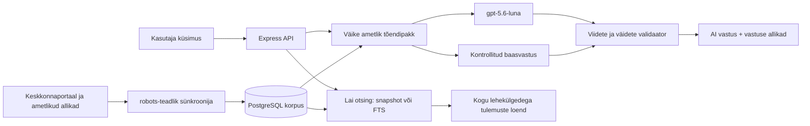

# Keskkonnaportaali arhitektuuri- ja otsinguuuring

Uuendatud: 17.08.2026

## Mida avalikust portaalist kinnitati

- Lehe HTML-i generaatori metaandmed näitavad, et [keskkonnaportaal.ee](https://keskkonnaportaal.ee/) töötab Drupal 11 peal.
- [Portaali otsing](https://keskkonnaportaal.ee/et/search?search_api_fulltext=mets) on serveris renderdatud Drupal View/Search API laadne GET-otsing. Päringuparameeter on `search_api_fulltext`, lehekülgi juhib `page` ja lehe suurust `items_per_page`.
- Kontrolli hetkel andis `mets` 953 tulemust. Tühja päringu lai kataloog andis 6057 otsingukaarti.
- [Sitemap](https://keskkonnaportaal.ee/sitemap.xml) jaguneb kaheks leheks ja sisaldas kokku 8407 URL-i (5000 + 3407).
- Avalik `/jsonapi` ei olnud kasutusel (404). Seetõttu ei eeldata dokumenteerimata Drupal JSON:API lepingut: korpus kasutab avalikku sitemap'i, otsingukaarte ja valitud lehtede puhastatud HTML-täisteksti.
- [robots.txt](https://keskkonnaportaal.ee/robots.txt) välistab haldus- ja sisemised rajad. Sünkroonija värskendab faili vähemalt kord tunnis, rakendab `Allow`/`Disallow` pikima vaste reeglit ning kasutab ainult lubatud avalikke sisulehti, väikest paralleelsust, viivitust, mahu- ja ajapiire. HTML-i `robots` meta ja vastuse `X-Robots-Tag: noindex` välistavad sisu indeksist. Iga ümbersuunamise siht kontrollitakse enne päringut uuesti HTTPS-i ja algselt lubatud hosti vastu.

Need tähelepanekud kirjeldavad avalikult nähtavat liidest, mitte Keskkonnaagentuuri privaatset infrastruktuuri. „Drupal View/Search API” on HTML-i vormi ja klasside põhjal tehtud tehniline järeldus; portaali sisemist seadistust projekt ei näe.

## Praktikarakenduse andmevoog

1. Server kontrollib korpuse vanust käivitumisel ja seejärel kord tunnis; kui viimane edukas jooks on vanem kui seadistatud 24 tundi, loeb sünkroonija sitemap'i, laiema portaaliotsingu ning etteantud tähtpäringud, näiteks `mets`.
2. URL-id kanoniseeritakse, duplikaadid ühendatakse ja metaandmed kirjutatakse PostgreSQL-i. Läbi vaadatud ametlik metsateadmus ning väike eestikeelne Vikipeedia taustakogu lisatakse eraldi allikatasemetega.
3. Valitud sisulehtedelt eemaldatakse menüüd, vormid, skriptid ja muu lehekroom. Puhas täistekst talletatakse ainult serveris. Igapäevane piiratud partii eelistab sisuta ja kõige vanemalt proovitud kirjeid, nii et katvus kasvab progressiivselt ega lae alati sama algust uuesti.
4. Kasutaja otsing käivitab kaks eraldi voogu:
   - lai tulemuste loend kasutab portaali säilitatud järjekorda või PostgreSQL-i täistekstiotsingut;
   - AI tõendivalik võtab piiratud hulga tugevaid ametlikke või sisuliselt läbi vaadatud dokumente.
5. `gpt-5.6-luna` saab ainult valitud tõendipaki, mitte kogu andmebaasi ega veebi. Mudel sõnastab otsese tavakeelse vastuse, selgitab tõendites defineeritud lühendid ning säilitab nummerdatud viited.
6. Server kontrollib viiteid, arve, aastaid, ühikuid, väite sõnalist katvust ja polaarsust. Kontrollimata mudelilõik lükatakse tagasi ning alles jääb läbi vaadatud algvastus.

Esimese täisjooksu tulemus 17.08.2026 oli 11 861 unikaalset kanoniseeritud URL-i. Üksteist välistavad allikatasemed jagunesid 10 977 `official`, 16 `reviewed`, 8 `supplementary` ja 860 `other` kirjeks; summa on 11 861. Sisuline serveripoolne täistekst oli 847 kirjel ja 11 014 kirjet olid ainult metaandmetega. `mets`-päringu 845 sobivast HTML-lehest puhastati edukalt 830, 12 katset ebaõnnestus ja 3 jäeti vahele mitte-HTML-i või liiga lühikese eraldatud sisu tõttu. Täistekstide koguarv ei ole nende arvude lihtsumma, sest osa 16 läbi vaadatud portaali algallikast kuulub ka 830 edukalt hüdrateeritud URL-i hulka. Need arvud on kontrollhetke snapshot, mitte koodi sisse kirjutatud püsiv lubadus.

Sama päeva uuesti tehtud täisjooks salvestas `mets` snapshot'i 20 lähtelihekülge × kuni 50 kaarti: portaali `upstream_total=953`, täpselt 953 salvestatud kaardiesinemist ja 752 eri kanoniseeritud URL-i. Kordused tulevad portaali enda lehekülgedelt (113 URL-i kordus kontrollis vähemalt korra), mitte meie andmebaasi duplikaatridadest. Avalik UI ütleb mõlemad arvud välja ja lehitseb 752 eri lehte 63 lehel suurusega 12; esimese kahe lehe vahel oli 0 URL-i kattuvust ning viimasel lehel 8 kirjet.

## PostgreSQL-i roll

PostgreSQL ei ole siin ainult vahemälu. Tabel `practice_corpus_documents` hoiab kanoniseeritud URL-i, pealkirja, kokkuvõtet, puhastatud sisu, väljaandjat, kuupäeva, teemasid, allikataset ja sünkroniseerimise metaandmeid. Otsinguvektor koostatakse pealkirjast, teemadest, kokkuvõttest ning sisust.

| Tabel | Sisu ja eluiga |
|---|---|
| `practice_corpus_documents` | avalike allikate püsiv, deduplikeeritud indeks; kadunud leht märgitakse kättesaamatuks alles pärast terviklikku edukat kataloogijooksu |
| `practice_corpus_query_snapshots` | ainult seadistatud seemnepäringu räsi/normaliseeritud väärtus, päritolu `configured-seed`, portaali koguarv, lähtelihtede arv ja suurus, `portal-default` sort, kõigi kaardiesinemiste URL-järjestus, eraldi esinemiste/unikaalsete URL-ide arv ja salvestusaeg; runtime kasutab kuni 72 tunni vanust snapshot'i |
| `practice_corpus_runs` | sünkroonijooksu olek ja agregaatloendurid, mitte allalaaditud saladused või kasutajaprofiilid |
| `practice_search_cache` | lühiajaline vastusevahemälu päringu SHA-256 räsi järgi; vastusest eemaldatakse päringutekst |
| `practice_search_runs` | kuni 30 päeva hoitav tehniline kestus/olek redigeeritud päringutunnusega |

Otsing kombineerib:

- `tsvector`/`tsquery` täistekstiotsingu;
- sõnaalguse päringud (`mets:*`), et eesti käändevormidega paremini toime tulla;
- `pg_trgm` pealkirjasarnasuse;
- allikataseme ja kuupäeva järjestussignaalid;
- täpsete portaali päringute snapshot'id. Portaal võib sama kanoniseeritud URL-i mitmel tulemusekohal korrata: seepärast säilitatakse nii kõik kaardiesinemised kui ka eraldi URL-ide arv. UI näitab portaali koguarvu, kuid lehekülgedel ühendab korduvad URL-id üheks leheks.

GIN-indeks kiirendab täistekstivälja ning trigrammiindeks pealkirja sarnasust. Rakenduse enda vastusevahemälu ja privaatsust hoidev tehniline sündmuslogi on samas eraldatud praktika andmebaasis, kuid korpusetabelitest lahus. PostgreSQL-i ametlikud alusmaterjalid: [Full Text Search](https://www.postgresql.org/docs/current/textsearch-controls.html) ja [GIN-indeksid](https://www.postgresql.org/docs/current/gin.html).

## Allikatasemed

| Tase | Näide | Kasutus |
|---|---|---|
| `reviewed` | versioonitud 16 ametliku allika metsakorpus | kõrgeima usaldusega, eelnevalt koostatud väited ja täpsed viited |
| `official` | Keskkonnaportaal, Keskkonnaagentuur, Keskkonnaamet, Statistikaamet | otsingutulemused ja AI tõendid, kui päringukate on piisav |
| `supplementary` | kaheksa kureeritud eestikeelset Vikipeedia artiklit | mõistete taust; ei ole üksinda värske arvu, õiguse ega ametliku seisu tõend |
| `other` | portaali otsingus leitud muu avalik leht | lai tulemuste loend; AI-le ei anta vaikimisi |

Vikipeedia sisu tuleb ametliku [MediaWiki Action API](https://www.mediawiki.org/wiki/API%3ASearch) kaudu. Artiklid on teadlikult taustallikad, mitte ametlike allikate asendajad.

## Miks Qdrant ei ole põhiotsing

Qdrant on vektorandmebaas: see leiab embedding'ute abil semantiliselt sarnaseid tekstilõike. Projektis olnud 256-mõõtmeline räsivektor ei olnud päris keele-embedding ning ei andnud evalides PostgreSQL-i hübriidotsingust paremat tulemust. Seetõttu on Qdrant ainult valikulises `experimental-vector` Compose'i profiilis. Selle võib tagasi tuua siis, kui lisatakse päris eestikeelne/mitmekeelne embedding, lõikude versioonimine ja külmutatud eval, mis tõendab mõõdetavat kvaliteedivõitu.

## AI kiht

Rakenduse sõnastusmudel on `gpt-5.6-luna`, mida kutsutakse serverist OpenCode Go Responses API kaudu. Väljuv päring sisaldab kasutaja kuni 180 märgini piiratud küsimust ja ainult serveri valitud avalikku tõendipakki; andmebaasi ülejäänud sisu, kasutajalogi ja saladusi ei saadeta. Kasutusel on range JSON Schema, madal reasoning-effort, 1600 väljundtokeni piir ning kogu päringu 15-sekundiline ülempiir. Mudel ei otsusta, milline allikas on ametlik, ei pääse PostgreSQL-i ega Qdranti ja ei tee ise veebipäringuid.

DeepSeek V4 Flash Swarm on arendusaegne planeerimis- ja auditikiht, mitte avaliku otsingu vastusemudel. Swarmile saadetakse ainult arendaja kompaktne eesmärgi- ja tõendikokkuvõte; kasutajapäringuid, andmebaasi sisu ega võtmeid sinna ei edastata. Portaali avalike lehtede tegeliku sünkroonimise teeb deterministlik serverikood, mitte agent.

See eristus on oluline:

- otsingumootor leiab ning järjestab suure tulemusehulga;
- tõendivärav valib väikese usaldusväärse allikakomplekti;
- Luna tõlgendab selle komplekti kasutaja küsimuse jaoks;
- server valideerib vastuse enne brauserile saatmist.

Seega ei tähenda viis „Vastuse allikat”, et otsing leidis ainult viis tulemust. Need on AI konkreetse vastuse tõendid; eraldi „Otsingutulemused” loend kuvab kogu 953-kirjelise portaaliotsingu lehekülgede kaupa.
