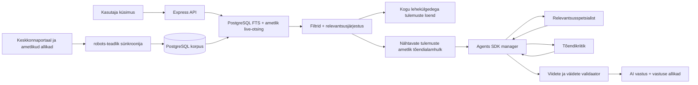

# Keskkonnaportaali arhitektuuri- ja otsinguuuring

Uuendatud: 01.10.2026

**Kehtiv allikapoliitika:** Statistikaamet on avalikest tulemustest, vastustest ja diagrammidest välistatud. Allpool mainitud PXWeb-adapterite tehnilised piirid säilivad ajalooliste skeemilepingutena, mitte avaliku tõendi erandina. Toetatud metsadiagrammid kasutavad Keskkonnaagentuuri SMI töövihikut; puuduva primaarse rea asemel ei kuvata teise väljaandja graafikut. Vt [allikaregister](ALLIKAD.md).

## Mida avalikust portaalist kinnitati

- Lehe HTML-i generaatori metaandmed näitavad, et [keskkonnaportaal.ee](https://keskkonnaportaal.ee/) töötab Drupal 11 peal.
- [Portaali otsing](https://keskkonnaportaal.ee/et/search?search_api_fulltext=mets) on serveris renderdatud Drupal View/Search API laadne GET-otsing. Päringuparameeter on `search_api_fulltext`, lehekülgi juhib `page` ja lehe suurust `items_per_page`.
- Kontrolli hetkel andis `mets` 953 tulemust. Tühja päringu lai kataloog andis 6057 otsingukaarti.
- [Sitemap](https://keskkonnaportaal.ee/sitemap.xml) jaguneb kaheks leheks ja sisaldas 01.10.2026 inventuuris kokku 8463 URL-i. XML-is olev iga `loc` kontrollitakse eraldi täpselt Keskkonnaportaali hosti vastu; sitemap ei saa välisele hostile `official` taset edasi anda.
- Avalik `/jsonapi` ei olnud kasutusel (404). Seetõttu ei eeldata dokumenteerimata Drupal JSON:API lepingut: korpus kasutab avalikku sitemap'i, otsingukaarte ja valitud lehtede puhastatud HTML-täisteksti.
- [robots.txt](https://keskkonnaportaal.ee/robots.txt) välistab haldus- ja sisemised rajad. Sünkroonija värskendab faili vähemalt kord tunnis, rakendab `Allow`/`Disallow` pikima vaste reeglit ning kasutab ainult lubatud avalikke sisulehti, väikest paralleelsust, viivitust, mahu- ja ajapiire. Robots-fail, read, grupid, reeglid, mustri pikkus ja metamärkide arv on eraldi piiratud; `*`-sobitus kasutab regexivaba järjestikust matcher'it. Upstream'i kuvatud tulemuste arv ei ole ressursieelarve: kataloogil on 20 000 dokumendi / 400 lehe ülempiir, lehti moodustatakse laisalt ning tühi või täielikult korduv leht peatab jooksu. HTML-i `robots` meta ja vastuse `X-Robots-Tag: noindex` välistavad sisu indeksist. Iga ümbersuunamise siht kontrollitakse enne päringut uuesti HTTPS-i ja algselt lubatud hosti vastu; keha loetakse voogedastavalt kuni baitpiirini enne parsimist.

Need tähelepanekud kirjeldavad avalikult nähtavat liidest, mitte Keskkonnaagentuuri privaatset infrastruktuuri. „Drupal View/Search API” on HTML-i vormi ja klasside põhjal tehtud tehniline järeldus; portaali sisemist seadistust projekt ei näe.

## Praktikarakenduse andmevoog

1. Server kontrollib korpuse vanust käivitumisel ja seejärel kord tunnis; kui viimane edukas jooks on vanem kui seadistatud 24 tundi, loeb sünkroonija sitemap'i, laiema portaaliotsingu ning etteantud tähtpäringud, näiteks `mets`.
2. URL-id kanoniseeritakse, duplikaadid ühendatakse ja metaandmed kirjutatakse PostgreSQL-i. Väike eestikeelne Vikipeedia taustakogu lisatakse eraldi allikatasemega; ajalooline läbi vaadatud metsakorpus jääb eval-materjaliks ega sisene primaarotsingu indeksisse.
3. Valitud sisulehtedelt eemaldatakse menüüd, vormid, skriptid ja muu lehekroom. Puhas täistekst talletatakse ainult serveris. Igapäevane piiratud partii eelistab sisuta ja kõige vanemalt proovitud kirjeid, nii et katvus kasvab progressiivselt ega lae alati sama algust uuesti.
4. Kasutaja otsing käivitab ühe ühise kandidaadivoo: PostgreSQL, kolm ametlikku Valitsusportaali indeksit ja päringule sobiv tüübikindel XML-, JSON-, CSV-, JSON-stat2- või WFS-adapter töötavad paralleelselt; tulemused deduplikeeritakse, filtreeritakse ning järjestatakse relevantsuse järgi. Hüdroloogia PostgREST-adapter saadab ainult serveris kureeritud jaamakoodi, seeria ja tunnise 36 tunni alampiiri ning hoiab „viimati avaldatud” tunniandmed reaalajapäringust eraldi. Kliima PostgREST-adapter seob ühe 25 kureeritud jaama koodi, fikseeritud `DTA08` elemendi ja ühest lubatud minevikukuupäevast eraldatud aasta/kuu/päeva; see nõuab üht sama identiteediga rida, täpset skeemi, °C ühikut ja allika avaldamisajatemplit. EELISe Emajõe adapter kasutab ainult fikseeritud `eelis:avalikud_vooluveekogud` kihti, KKR-koodi ja seitset väljanime. Nimega Natura adapter seob ühe kuuest kureeritud loodusalast serveris hoitava täpse nime, EL-i ja KKR-koodiga ning küsib `f_rahvalad` teenuselt fikseeritud kümmet välja; isikliku tegevusõiguse, ajaloolise seisu või mitme ala päring lükatakse enne välispäringut tagasi. Statistikaameti KK048, KK25 ja KK068 adapterid kasutavad eraldi redirectideta HTTPS POST-transporti, fikseeritud 2024. aasta Eesti koondmõõtmeid ning 256 kB vastusepiiri. KK610 seob ühe sõnaselge aasta 2002–2024 jäätmete kogusumma ja näitajaga „taaskasutamine”; määrad, alaliigid, kohalik ulatus ja võrdlused ei sisene adapterisse. Kasutaja toortekst ei jõua EELISe ega PXWeb päringufiltrisse või POST-kehasse, vana API `updated` väli ei muutu avaldamisajaks ning puuduva allalaadimisaja või stale-vastusega tõendit ei looda. Sama kanoonilise URL-i aliaste välju võib rikastada, kuid adapteriga seotud projektsioon jääb koos oma tõendikeha, hash'i, poliitika ja lokaatoriga atomaarseks; ainult sarnase pealkirjaga eri URL-idest valitakse üks terviklik kirje. Mitmesõnaline SQL-kandidaat peab katma kõik mõisterühmad; käänded ja sünonüümid on rühma sees alternatiivid. Päringuanalüüs lisab vajaliku allikarolli, näiteks reaalaja ilma, registri, ajaloolise vaatluse, näitaja või juhendi; läbi vaadatud täpne teenusevastendus jääb kehtima ka siis, kui lühike kataloogikaart ei korda kõiki päringu sõnu, kuid ei anna teemavälisele dokumendile vastamisõigust. Küsitud andmeaasta otsitakse tõendi pealkirjast ja tekstist ning seda ei samastata artikli avaldamisaastaga. Lai tulemuste loend ja AI tõendivalik pärinevad samast hulgast. Kuni kuue kõrgeima asetusega lehe päringuaegne hüdratsioon läbib nelja töökoha ja piiratud järjekorraga globaalse värava; sama URL-i paralleelsed laadimised koondatakse. Kõik avalikud otsingurajad kasutavad ühist kliendipõhist ringmeetodil pääsuväravat: ühe abuse-control identiteedi aktiivpiir on globaalsest piirist alati väiksem ning katkestatud või 1,8 sekundit oodanud järjekirje eemaldatakse koos kuulajate ja taimeriga. IPv4 identiteet on aadress, IPv6 identiteet on vaikimisi `/64` võrk (operaatori seadistatav `/32`–`/128`), mistõttu privacy-aadressi roteerimine ei loo uut rate-limit-, admission- ega LLM-kvooti.
5. OpenAI `openai-codex/gpt-6-luna` saab sama nähtava tulemusehulga piiratud tõendipaki. Tootmise `LLM_ORCHESTRATION=direct` kasutab üht Responses API mudelikõnet, et säilitada 15-sekundiline otsingueelarve. Valikulises `agents` režiimis käivitab SDK manager mitme tõendiallika korral ühekordse review-tööriistaga järjest relevantsusspetsialisti ja tõendikriitiku; spetsialistid ei saa algsest pakist laiemaid andmeid ega veebitööriistu. Iga allika tõendipakis on kuni 4000-märgiline päringupõhine lõiguaken, tüüp, marsruudiklass, tõendipoliitika, värskusklass ning olemasolul vaatlus- või versiooniaeg. Libiseva akna päringu- ja tokenieelarve reserveeritakse enne mudelikõnet; ammendumine jätab sama jooksu deterministliku tõendivastuse alles.
   Ühe tõendiallika korral nõuab mudeli viimane juhis `intro` ja iga `parts.text` faktiliste lausete valimist `evidence.content` lausete hulgast muutmata sõnastusega: mudel võib lauseid valida ja järjestada, kuid ei lisa parafraase, analoogiaid ega tõendist tuletatud järeldusi ning selgitab lühendit ainult tõendi enda definitsioonilausega. Mitme tõendiallika korral tuleb mudelil koostada sidus, algallikate mõisteid ja neutraalset sõnastust hoidev viidatud süntees, mitte kopeeritud lõikude loend; iga väide peab jääma nähtavate tõendite piiresse. Ühe allika konservatiivne sõnastuspiir ega mitme allika süntees ei asenda järgnevat sõltumatut serveripoolset valideerimist.
   Päringu väljundleping annab mudelile jooksva valideeritud sissejuhatuse väite ja selle tegelikud tõendiviited, mitte fikseeritud näidisviite `[1]`. Viited piiratakse saadetava tõendipaki citation-väärtustega; sissejuhatuse otsest tõendatud väidet ei tohi asendada kõrvalallika selgitusega. Viiteinfo ja vastuse proosa on eraldi väljades.
6. Server kontrollib mudeli väljundis viiteid, arve, aastaid, ühikuid, väite sõnalist katvust, polaarsust ja vastuse otsest seost küsimuse intentidega. Iga arv seotakse samas tõendilõigus oleva koha, asutuse, liigi või muu subjektiga; päringust moodustatud vastusepealkirja ei käsitata tõendina. Kontrollimata või kõrvalfaktile vastav mudelilõik lükatakse tagasi. Mudelitõrke korral säilib sama jooksva allika viidatud otsene lõik, mitte ajalooline eelvastus.

Järgnev skeem kirjeldab valikulist `agents` režiimi. Tootmise `direct`
režiimis liigub tõendipakk ühe Luna mudelikõne kaudu samasse validaatorisse.

Esimese täisjooksu tulemus 17.08.2026 oli 11 861 unikaalset kanoniseeritud URL-i ja 847 serveripoolse täistekstiga kirjet. Hilisemad ametlikud live-otsingud lisavad leitud URL-id ühe globaalse kirjutaja, kuni 500 ootel URL-i ja 50-kirjeliste partiidega korpusesse; URL-id koondatakse enne andmebaasitööd. `official-live-search` kirje peidetakse vaikimisi 7 päeva ja kustutatakse 14 päeva järel, kui seda uuesti ei avastata, ning sama vanusefilter kehtib ka lugemisel. Vana `reviewed-forestry` indeksikiht migreeritakse neutraalseks ametliku URL-i kirjeks ja selle eelkirjutatud vastusetekst eemaldatakse.

18.08.2026 vahekontrollis oli eraldatud PostgreSQL-i korpuses 12 492 kanoniseeritud dokumenti, millest 1795 olid hüdrateeritud sisuga; 11 624 kirjet olid ametliku allikatasemega. Need on kasvava indeksi hetkeseis, mitte muutumatu tootekonstant.

Sama päeva täisjooks salvestas `mets` auditi-snapshot'i 20 lähtelihekülge × kuni 50 kaarti: portaali `upstream_total=953`, 953 kaardiesinemist ja 752 eri kanoniseeritud URL-i. Need arvud dokumenteerivad tollast lähteseisu ja duplikaate, kuid runtime ei kuva ega järjesta tulemusi enam selle vana snapshot'i järgi: esimene leht sünnib PostgreSQL-i ning ametliku live-otsingu ühendatud, deduplikeeritud ja relevantsusjärjestatud hulgast.

## PostgreSQL-i roll

PostgreSQL ei ole siin ainult vahemälu. Tabel `practice_corpus_documents` hoiab kanoniseeritud URL-i, pealkirja, kokkuvõtet, puhastatud sisu, väljaandjat, kuupäeva, teemasid, allikataset ja sünkroniseerimise metaandmeid. Otsinguvektor koostatakse pealkirjast, teemadest, kokkuvõttest ning sisust.

| Tabel | Sisu ja eluiga |
|---|---|
| `practice_corpus_documents` | avalike allikate püsiv, deduplikeeritud indeks; kadunud leht märgitakse kättesaamatuks alles pärast terviklikku edukat kataloogijooksu |
| `practice_corpus_query_snapshots` | ainult seadistatud seemnepäringu audit-snapshot; primaarne runtime'i relevantsusotsing ei kasuta portaali vana järjestust vastuse ega esimese lehe otseteena |
| `practice_corpus_runs` | sünkroonijooksu olek ja agregaatloendurid, mitte allalaaditud saladused või kasutajaprofiilid |

Kättesaamatud portaali sitemap'i, kataloogi ja hüdratsiooniread kustutatakse vaikimisi 30 päeva järel. Sama andmebaasi kõik replikaad, täissünk ja päringuaegne live-avastus jagavad üht PostgreSQL-i tehingulist capacity advisory-lukku. Iga kuni 250 kirje kirjutuspartii arvestab enne insert'i nii kättesaadavaid kui kättesaamatuid ridu, kogu ligikaudset salvestusmahtu ja olemasolevaid URL-e; üle 150 000 rea või 2 GB vaikepiiri minev osa jäetakse kirjutamata. Ka hilisem lehehüdratsioon võtab sama luku, mõõdab pärast sisu ja genereeritud otsinguvektori asendamist tegeliku reaagregaadi ning teeb üle baidipiiri mineva muudatuse rollback'i. Piiratud hoolduspartiid eemaldavad vana võla ning lõpetatud jooksude ajalugu on piiratud 1000 reaga. Kuupäevad läbivad enne PostgreSQL-i tüübitõlgendust range kalendri- ja ISO-ajatempli kontrolli.
| `practice_search_cache` | lühiajaline vastusevahemälu võtmega HMAC-sõrmejälje järgi; `privacy-safe-v6` ei talleta mudeli loodud proosat, päringut ega selle pealkirja, säilitab ainult avalikud allikaväljad ja piiratud sisemise tõendipoliitika/värskuse metaandmestiku taasvalideerimiseks, välistab tundlikke identifikaatoreid ja sisulisi päringufragmente sisaldavad vastused ning dekodeerib enne JSON-serialiseerimist URL-, HTML- ja kaldkriipsuga põgenemise vormid fikspunktini või loobub cache-kirjutusest |
| `practice_search_runs` | kuni 30 päeva hoitav tehniline kestus/olek ainult võtmega HMAC-päringusõrmejäljega; päringuteksti veerg puudub |

Otsing kombineerib:

- `tsvector`/`tsquery` täistekstiotsingu;
- sõnaalguse päringud (`mets:*`), et eesti käändevormidega paremini toime tulla;
- mõisterühmadevahelise `AND`-loogika ning mõistesisese `OR`-loogika, näiteks `mets:* & (noor:* | vanus:*)`, et pelk kohanime vaste ei tooks teemaväliseid tulemusi;
- `pg_trgm` pealkirjasarnasuse;
- allikataseme ja kuupäeva järjestussignaalid;
- pealkirja, kokkuvõtte ja sama tekstilõigu tüvekatet, mis hoiab eri kohtades juhuslikult esinevad märksõnad täpsest vastest allpool;
- ametliku allika, täisteksti ja tegeliku avaldamiskuupäeva lisasignaale. Tulevikukuupäev ei saa värskusboonust ning värskus ei tõsta teemavälist lehte täpse vaste kohale.

GIN-indeks kiirendab täistekstivälja ning trigrammiindeks pealkirja sarnasust. Rakenduse enda vastusevahemälu ja privaatsust hoidev tehniline sündmuslogi on samas eraldatud praktika andmebaasis, kuid korpusetabelitest lahus. PostgreSQL-i ametlikud alusmaterjalid: [Full Text Search](https://www.postgresql.org/docs/current/textsearch-controls.html) ja [GIN-indeksid](https://www.postgresql.org/docs/current/gin.html).

Lehitsemise stabiilsuseks moodustab server igal lehel sama relevantsusjärjestatud prefiksi kuni 50 kohaliku kandidaadi, ametlike live-vastete ja teenusekataloogi põhjal. Kui leht ulatub prefiksist kaugemale, küsitakse ülejäänud saba PostgreSQL-ist prefiksi kanoniseeritud URL-e välistades. See säilitab relevantsuse esimestel lehtedel ja väldib kordusi lehtede vahel.

## Allikatasemed

| Tase | Näide | Kasutus |
|---|---|---|
| `reviewed` | võimalik tulevane eksperdi kinnitatud dünaamiline kirje | sama tulemusehulga tugev tõend; ajaloolist eelkirjutatud metsakorpust runtime'is enam nii ei indekseerita |
| `official` | Keskkonnaportaal, Keskkonnaagentuur, Keskkonnaamet ja teised lubatud ametlikud väljaandjad | otsingutulemused ja AI tõendid, kui päringukate on piisav; Statistikaamet on allikavalikust välistatud |
| `supplementary` | kaheksa kureeritud eestikeelset Vikipeedia artiklit | mõistete taust; ei ole üksinda värske arvu, õiguse ega ametliku seisu tõend |
| `other` | portaali otsingus leitud muu avalik leht | lai tulemuste loend; AI-le ei anta vaikimisi |

Vikipeedia sisu tuleb ametliku [MediaWiki Action API](https://www.mediawiki.org/wiki/API%3ASearch) kaudu. Artiklid on teadlikult taustallikad, mitte ametlike allikate asendajad.

## Allikaroll ja tõendipoliitika

`server/source-registry.mjs` teeb allika transportimise ja tõendusõiguse teadlikult eri asjadeks. 119 kureeritud kirjet jaotuvad marsruudiklassidesse nagu `official_live_weather`, `official_spatial_or_register`, `official_indicator_or_report` ja `official_guidance`. See aitab kasutajal jõuda õigesse ametlikku teenusesse ka siis, kui selle landing page ei ole faktitõend.

`route-only` kirje ei sisene AI tõendipakki; `timestamped` nõuab adapteri mõõte- või kehtivusaega; `versioned` nõuab versiooni või staatuse aega; `claim-specific` vajab päringu põhitingimusi katvat puhastatud lõiku. Duplikaatide ühendamisel säilib piiravam poliitika, seega ei saa sama URL-i rikkalikum alias `route-only` maandumislehte kogemata tõendikõlblikuks muuta.

## Miks Qdrant ei ole põhiotsing

Qdrant on vektorandmebaas: see leiab embedding'ute abil semantiliselt sarnaseid tekstilõike. Projektis olnud 256-mõõtmeline räsivektor ei olnud päris keele-embedding ning ei andnud evalides PostgreSQL-i hübriidotsingust paremat tulemust. Seetõttu on Qdrant ainult valikulises `experimental-vector` Compose'i profiilis. Selle võib tagasi tuua siis, kui lisatakse päris eestikeelne/mitmekeelne embedding, lõikude versioonimine ja külmutatud eval, mis tõendab mõõdetavat kvaliteedivõitu.

## AI kiht

Rakenduse sõnastusmudel on `openai-codex/gpt-6-luna`, mida kutsutakse serverist autenditud Codex gateway Responses API kaudu. Tootmises kasutatakse `LLM_ORCHESTRATION=direct`: üks mudelikõne ja sõltumatu serveripoolne tõendikontroll. Valikuline `agents` režiim kasutab mitme allika korral SDK manageri ja kaht järjestikust review-spetsialisti; selle neljakutseline tervikvoog ületas 06.10.2026 live-kontrollides senise ajapiiri. Väljuv päring sisaldab kuni 180 märgini piiratud küsimust ja ainult valitud avalikku tõendipakki. Kasutusel on range JSON-väljundleping, madal reasoning-effort, kuni 3200 väljundtokenit, `LLM_TIMEOUT_MS=14500` ja kogu päringu 15-sekundiline ülempiir. Tunnine libisev eelarve lubab vaikimisi kuni 60 mudelipäringut ja 240 000 sisend- ning väljundtokenit kokku. Iga dispatch reserveerib enne võrku saatmist sisendi-, väljundi- ja protokollivaru; vastuse järel asendub see raporteeritud kogutokenitega. Teadmata kasutusega katkestus debiteerib täisreservi. Transport ei järgi redirecte, ei tee peidetud retry'sid ja piirab vastuse 1 MB-ni. Deterministlik server otsustab enne mudelikõnet, milline allikas on ametlik ja tõendikõlblik; mudel ei pääse PostgreSQL-i, Qdranti ega veebi. Eelarve-, mahu-, timeout'i või validaatoritõrke korral säilib sama jooksva tõendi viidatud deterministlik draft, mitte teine varumudel.

LLM-kutsed on välised serveritevahelised päringud, mitte lokaalne mudel. OpenAI teenusele saadetakse autenditud Codex gateway kaudu `question`, kuni kümne valitud avaliku allika päringufookusega lõiguaken (kuni 4000 märki allika kohta ja kokku kuni 36 000 märki), pealkiri/URL, allikaroll, tõendipoliitika, värskusklass ning olemasolul vaatlus- või versiooniaeg, väljundskeem ja jätkuküsimuse korral kuni 1400 märki varasemate küsimuste konteksti. Valikulised agendid töötavad sama piiri sees. Kõigil mudelikõnedel on `store: false`; SDK tracing on keelatud. Globaalset päringu-/tokenieelarvet täiendab protsessisaladusega pseudonüümitud kliendivõtme libiseva akna kvoot; deterministlik allikapõhine vastus jääb kvoodi täitumisel alles. Gateway bearer `LLM_API_KEY` seotakse käivitumisel täpselt lubatud `https://terrapoint.arleserver.cfd/v1` alusega; muu skeem, host, port, mandaat, päringuosa või fragment peatab käivituse ning transport ei järgi ümbersuunamisi. OpenAI Codex OAuth jääb hosti OMP auth brokerisse ja gateway'sse, mitte veebirakendusse. Kasutaja IP-d, brauseriküpsiseid, brauseri mandaate, serverisaladusi, PostgreSQL-i logi, kogu korpust ega Terrapointi andmeid mudeli sisendile ei lisata; küsimus ise võib siiski sisaldada kasutaja vabatahtlikult sisestatud isikuandmeid. Rakenduse `store: false` ja tracing'u keeld ei tõenda OpenAI ega gateway logimise, säilitamise või treeningu tingimusi; need tuleb kehtiva konto ja gateway poliitika alusel eraldi kinnitada. Seetõttu ei tohi kasutaja otsingusse panna saladusi ega tundlikke isikuandmeid. Terrapointi proxy ja live-grounding audit kasutavad käsitsi kontrollitud ümbersuunamisi, täpset päritoluloendit, tegeliku TLS-sokli avaliku IP kontrolli ning voogedastatud keha baitpiiri.

Keskkonnaportaali, Keskkonnaameti, Keskkonnaagentuuri ja Kliimaministeeriumi live-avastus toimub samuti serverist: need allikad näevad praktikaserveri päringut ja väljuvat IP-d, mitte brauseri IP-d. Valitsusportaali vastus valideeritakse ja projitseeritakse enne vahemällu salvestamist kuni kuue dokumendi, 12 kasutatava fragmendi dokumendi kohta ning 48/192 kB dokumendi/vastuse HTML-mahupiiri sisse; üks dokument käivitab kõige rohkem ühe sünkroonse HTML-parseri töö. Terrapointi iframe laetakse seevastu kasutaja brauserist otse `terrapoint.ee` domeenilt ning selle sandbox lubab ainult vormid, skriptid ja sama päritolu rakenduse semantika, mitte popup'e või top-level navigatsiooni; OpenStreetMapi frame ei saa ka vormiõigust. Terrapointi sees sisestatud aadress või katastritunnus ning tavalised brauseri võrguandmed lähevad Terrapointile selle enda tingimustel. Praktikaportaali üldotsing ei saada oma päringut Terrapointile ning projekt ei lisa analüütikaskripte.

See eristus on oluline:

- otsingumootor leiab ning järjestab suure tulemusehulga;
- tõendivärav valib väikese usaldusväärse allikakomplekti;
- Luna koostab selle komplekti põhjal vastuse ühe mudelikõnega; valikuline `agents` režiim lisab manageri ja kaks tõendispetsialisti;
- server valideerib vastuse enne brauserile saatmist.

Seega ei tähenda viis „Vastuse allikat”, et otsing leidis ainult viis tulemust. Need on AI konkreetse vastuse tõendid; eraldi „Otsingutulemused” loend kuvab sama filtreeritud kandidaadihulga lehekülgede kaupa. Allika-, sisutüübi- või aastafiltri muutmine loob uue tõendihulga ja uue vastuse.
