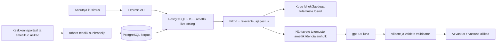

# Keskkonnaportaali arhitektuuri- ja otsinguuuring

Uuendatud: 18.08.2026

## Mida avalikust portaalist kinnitati

- Lehe HTML-i generaatori metaandmed näitavad, et [keskkonnaportaal.ee](https://keskkonnaportaal.ee/) töötab Drupal 11 peal.
- [Portaali otsing](https://keskkonnaportaal.ee/et/search?search_api_fulltext=mets) on serveris renderdatud Drupal View/Search API laadne GET-otsing. Päringuparameeter on `search_api_fulltext`, lehekülgi juhib `page` ja lehe suurust `items_per_page`.
- Kontrolli hetkel andis `mets` 953 tulemust. Tühja päringu lai kataloog andis 6057 otsingukaarti.
- [Sitemap](https://keskkonnaportaal.ee/sitemap.xml) jaguneb kaheks leheks ja sisaldas kokku 8407 URL-i (5000 + 3407).
- Avalik `/jsonapi` ei olnud kasutusel (404). Seetõttu ei eeldata dokumenteerimata Drupal JSON:API lepingut: korpus kasutab avalikku sitemap'i, otsingukaarte ja valitud lehtede puhastatud HTML-täisteksti.
- [robots.txt](https://keskkonnaportaal.ee/robots.txt) välistab haldus- ja sisemised rajad. Sünkroonija värskendab faili vähemalt kord tunnis, rakendab `Allow`/`Disallow` pikima vaste reeglit ning kasutab ainult lubatud avalikke sisulehti, väikest paralleelsust, viivitust, mahu- ja ajapiire. HTML-i `robots` meta ja vastuse `X-Robots-Tag: noindex` välistavad sisu indeksist. Iga ümbersuunamise siht kontrollitakse enne päringut uuesti HTTPS-i ja algselt lubatud hosti vastu.

Need tähelepanekud kirjeldavad avalikult nähtavat liidest, mitte Keskkonnaagentuuri privaatset infrastruktuuri. „Drupal View/Search API” on HTML-i vormi ja klasside põhjal tehtud tehniline järeldus; portaali sisemist seadistust projekt ei näe.

## Praktikarakenduse andmevoog

1. Server kontrollib korpuse vanust käivitumisel ja seejärel kord tunnis; kui viimane edukas jooks on vanem kui seadistatud 24 tundi, loeb sünkroonija sitemap'i, laiema portaaliotsingu ning etteantud tähtpäringud, näiteks `mets`.
2. URL-id kanoniseeritakse, duplikaadid ühendatakse ja metaandmed kirjutatakse PostgreSQL-i. Väike eestikeelne Vikipeedia taustakogu lisatakse eraldi allikatasemega; ajalooline läbi vaadatud metsakorpus jääb eval-materjaliks ega sisene primaarotsingu indeksisse.
3. Valitud sisulehtedelt eemaldatakse menüüd, vormid, skriptid ja muu lehekroom. Puhas täistekst talletatakse ainult serveris. Igapäevane piiratud partii eelistab sisuta ja kõige vanemalt proovitud kirjeid, nii et katvus kasvab progressiivselt ega lae alati sama algust uuesti.
4. Kasutaja otsing käivitab ühe ühise kandidaadivoo: PostgreSQL ja kolm ametlikku Valitsusportaali indeksit otsivad paralleelselt, tulemused deduplikeeritakse, filtreeritakse ning järjestatakse relevantsuse järgi. Mitmesõnaline SQL-kandidaat peab katma kõik mõisterühmad; käänded ja sünonüümid on rühma sees alternatiivid. Küsitud andmeaasta otsitakse tõendi pealkirjast ja tekstist ning seda ei samastata artikli avaldamisaastaga. Lai tulemuste loend ja AI tõendivalik pärinevad samast hulgast.
5. `gpt-5.6-luna` saab ainult valitud tõendipaki, mitte kogu andmebaasi ega veebi. Mudel sõnastab otsese tavakeelse vastuse, selgitab tõendites defineeritud lühendid ning säilitab nummerdatud viited.
6. Server kontrollib viiteid, arve, aastaid, ühikuid, väite sõnalist katvust, polaarsust ja vastuse otsest seost küsimuse intentidega. Kontrollimata või kõrvalfaktile vastav mudelilõik lükatakse tagasi; üks korduskatse võib kasutada sama tõendipakki. Mudelitõrke korral säilib sama jooksva allika viidatud otsene lõik, mitte ajalooline eelvastus.

Esimese täisjooksu tulemus 17.08.2026 oli 11 861 unikaalset kanoniseeritud URL-i ja 847 serveripoolse täistekstiga kirjet. Hilisemad ametlikud live-otsingud lisavad leitud URL-id taustal korpusesse, mistõttu `/api/corpus` arvud kasvavad. Vana `reviewed-forestry` indeksikiht migreeritakse neutraalseks ametliku URL-i kirjeks ja selle eelkirjutatud vastusetekst eemaldatakse.

18.08.2026 vahekontrollis oli eraldatud PostgreSQL-i korpuses 12 492 kanoniseeritud dokumenti, millest 1795 olid hüdrateeritud sisuga; 11 624 kirjet olid ametliku allikatasemega. Need on kasvava indeksi hetkeseis, mitte muutumatu tootekonstant.

Sama päeva täisjooks salvestas `mets` auditi-snapshot'i 20 lähtelihekülge × kuni 50 kaarti: portaali `upstream_total=953`, 953 kaardiesinemist ja 752 eri kanoniseeritud URL-i. Need arvud dokumenteerivad tollast lähteseisu ja duplikaate, kuid runtime ei kuva ega järjesta tulemusi enam selle vana snapshot'i järgi: esimene leht sünnib PostgreSQL-i ning ametliku live-otsingu ühendatud, deduplikeeritud ja relevantsusjärjestatud hulgast.

## PostgreSQL-i roll

PostgreSQL ei ole siin ainult vahemälu. Tabel `practice_corpus_documents` hoiab kanoniseeritud URL-i, pealkirja, kokkuvõtet, puhastatud sisu, väljaandjat, kuupäeva, teemasid, allikataset ja sünkroniseerimise metaandmeid. Otsinguvektor koostatakse pealkirjast, teemadest, kokkuvõttest ning sisust.

| Tabel | Sisu ja eluiga |
|---|---|
| `practice_corpus_documents` | avalike allikate püsiv, deduplikeeritud indeks; kadunud leht märgitakse kättesaamatuks alles pärast terviklikku edukat kataloogijooksu |
| `practice_corpus_query_snapshots` | ainult seadistatud seemnepäringu audit-snapshot; primaarne runtime'i relevantsusotsing ei kasuta portaali vana järjestust vastuse ega esimese lehe otseteena |
| `practice_corpus_runs` | sünkroonijooksu olek ja agregaatloendurid, mitte allalaaditud saladused või kasutajaprofiilid |
| `practice_search_cache` | lühiajaline vastusevahemälu päringu SHA-256 räsi järgi; vastusest eemaldatakse päringutekst |
| `practice_search_runs` | kuni 30 päeva hoitav tehniline kestus/olek redigeeritud päringutunnusega |

Otsing kombineerib:

- `tsvector`/`tsquery` täistekstiotsingu;
- sõnaalguse päringud (`mets:*`), et eesti käändevormidega paremini toime tulla;
- mõisterühmadevahelise `AND`-loogika ning mõistesisese `OR`-loogika, näiteks `mets:* & (noor:* | vanus:*)`, et pelk kohanime vaste ei tooks teemaväliseid tulemusi;
- `pg_trgm` pealkirjasarnasuse;
- allikataseme ja kuupäeva järjestussignaalid;
- pealkirja, kokkuvõtte ja sama tekstilõigu tüvekatet, mis hoiab eri kohtades juhuslikult esinevad märksõnad täpsest vastest allpool;
- ametliku allika, täisteksti ja tegeliku avaldamiskuupäeva lisasignaale. Tulevikukuupäev ei saa värskusboonust ning värskus ei tõsta teemavälist lehte täpse vaste kohale.

GIN-indeks kiirendab täistekstivälja ning trigrammiindeks pealkirja sarnasust. Rakenduse enda vastusevahemälu ja privaatsust hoidev tehniline sündmuslogi on samas eraldatud praktika andmebaasis, kuid korpusetabelitest lahus. PostgreSQL-i ametlikud alusmaterjalid: [Full Text Search](https://www.postgresql.org/docs/current/textsearch-controls.html) ja [GIN-indeksid](https://www.postgresql.org/docs/current/gin.html).

Lehitsemise stabiilsuseks moodustab server igal lehel sama relevantsusjärjestatud prefiksi kuni 50 kohaliku kandidaadi, ametlike live-vastete ja teenusekataloogi põhjal. Kui leht ulatub prefiksist kaugemale, küsitakse ülejäänud saba PostgreSQL-ist prefiksi kanoniseeritud URL-e välistades. See säilitab relevantsuse esimestel lehtedel ja väldib kordusi lehtede vahel.

## Allikatasemed

| Tase | Näide | Kasutus |
|---|---|---|
| `reviewed` | võimalik tulevane eksperdi kinnitatud dünaamiline kirje | sama tulemusehulga tugev tõend; ajaloolist eelkirjutatud metsakorpust runtime'is enam nii ei indekseerita |
| `official` | Keskkonnaportaal, Keskkonnaagentuur, Keskkonnaamet, Statistikaamet | otsingutulemused ja AI tõendid, kui päringukate on piisav |
| `supplementary` | kaheksa kureeritud eestikeelset Vikipeedia artiklit | mõistete taust; ei ole üksinda värske arvu, õiguse ega ametliku seisu tõend |
| `other` | portaali otsingus leitud muu avalik leht | lai tulemuste loend; AI-le ei anta vaikimisi |

Vikipeedia sisu tuleb ametliku [MediaWiki Action API](https://www.mediawiki.org/wiki/API%3ASearch) kaudu. Artiklid on teadlikult taustallikad, mitte ametlike allikate asendajad.

## Miks Qdrant ei ole põhiotsing

Qdrant on vektorandmebaas: see leiab embedding'ute abil semantiliselt sarnaseid tekstilõike. Projektis olnud 256-mõõtmeline räsivektor ei olnud päris keele-embedding ning ei andnud evalides PostgreSQL-i hübriidotsingust paremat tulemust. Seetõttu on Qdrant ainult valikulises `experimental-vector` Compose'i profiilis. Selle võib tagasi tuua siis, kui lisatakse päris eestikeelne/mitmekeelne embedding, lõikude versioonimine ja külmutatud eval, mis tõendab mõõdetavat kvaliteedivõitu.

## AI kiht

Rakenduse sõnastusmudel on `gpt-5.6-luna`, mida kutsutakse serverist OpenCode Go Responses API kaudu. Väljuv päring sisaldab kasutaja kuni 180 märgini piiratud küsimust ja ainult serveri valitud avalikku tõendipakki; andmebaasi ülejäänud sisu, kasutajalogi ja saladusi ei saadeta. Kasutusel on range JSON Schema, madal reasoning-effort, 1600 väljundtokeni piir ning kogu päringu 15-sekundiline ülempiir. Mudel ei otsusta, milline allikas on ametlik, ei pääse PostgreSQL-i ega Qdranti, ei tee ise veebipäringuid ega saa tõendatud kõrvalfaktiga kasutaja tegelikku küsimust asendada.

LLM-kutse on väline serveritevaheline päring, mitte lokaalne mudel. OpenCode Go-le saadetakse `question`, kuni kaheksa valitud avaliku allika piiratud pealkiri/URL/kokkuvõte või puhastatud tõenditekst, väljundskeem ning jätkuküsimuse korral kuni 520 märki varasemate küsimuste konteksti. Filtrid mõjutavad tõendite valikut, kuid kasutaja IP-d, brauseriküpsiseid, PostgreSQL-i logi, kogu korpust ega Terrapointi andmeid payload'i ei lisata; teenus näeb siiski praktikaserveri väljuvat IP-aadressi ning küsimus ise võib sisaldada kasutaja vabatahtlikult sisestatud isikuandmeid. [OpenCode Go ametlik privaatsustabel](https://opencode.ai/docs/go/#privacy) ütleb `GPT 5.6 Luna` kohta „model training: not used” ja kuni 30 päeva abuse-monitoring'u logide säilitamist. Seetõttu ei tohi kasutaja otsingusse panna saladusi ega tundlikke isikuandmeid.

Keskkonnaportaali, Keskkonnaameti, Keskkonnaagentuuri ja Kliimaministeeriumi live-avastus toimub samuti serverist: need allikad näevad praktikaserveri päringut ja väljuvat IP-d, mitte brauseri IP-d. Terrapointi iframe laetakse seevastu kasutaja brauserist otse `terrapoint.ee` domeenilt; Terrapointi sees sisestatud aadress või katastritunnus ning tavalised brauseri võrguandmed lähevad Terrapointile selle enda tingimustel. Praktikaportaali üldotsing ei saada oma päringut Terrapointile ning projekt ei lisa analüütikaskripte.

DeepSeek V4 Flash Swarm on arendusaegne planeerimis- ja auditikiht, mitte avaliku otsingu vastusemudel. Swarmile saadetakse ainult arendaja kompaktne eesmärgi- ja tõendikokkuvõte; kasutajapäringuid, andmebaasi sisu ega võtmeid sinna ei edastata. Portaali avalike lehtede tegeliku sünkroonimise teeb deterministlik serverikood, mitte agent.

See eristus on oluline:

- otsingumootor leiab ning järjestab suure tulemusehulga;
- tõendivärav valib väikese usaldusväärse allikakomplekti;
- Luna tõlgendab selle komplekti kasutaja küsimuse jaoks;
- server valideerib vastuse enne brauserile saatmist.

Seega ei tähenda viis „Vastuse allikat”, et otsing leidis ainult viis tulemust. Need on AI konkreetse vastuse tõendid; eraldi „Otsingutulemused” loend kuvab sama filtreeritud kandidaadihulga lehekülgede kaupa. Allika-, sisutüübi- või aastafiltri muutmine loob uue tõendihulga ja uue vastuse.
